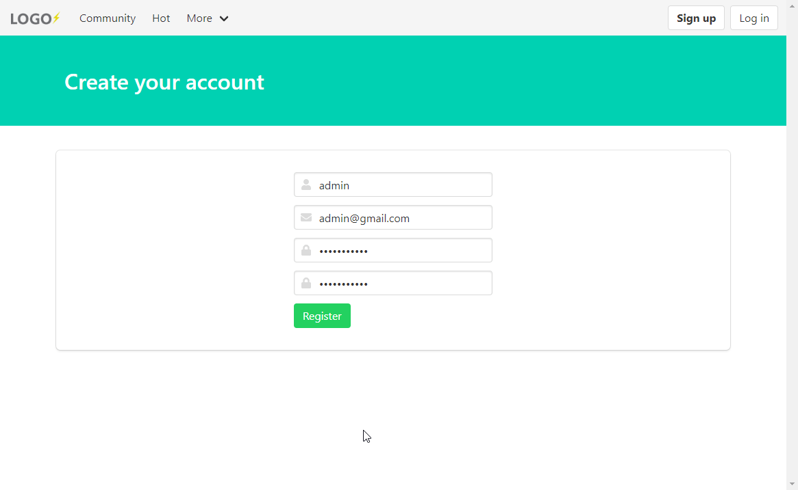
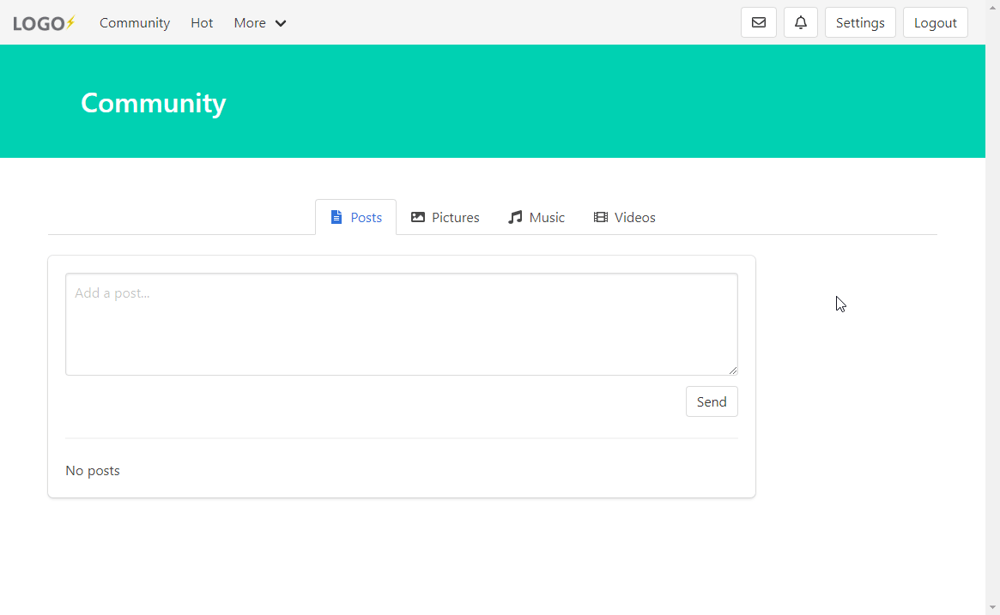

# mateuszjanczak/community

An early version of the project inspired by the microblog at wykop.pl 

It's built on a Laravel framework! Mobile friendly by Bulma.css

## Laravel Documentation

Documentation for the framework can be found on the [Laravel website](https://laravel.com/docs/5.8).


## Requirements
PHP >= 7.2.0, BCMath PHP Extension, Ctype PHP Extension, JSON PHP Extension, Mbstring PHP Extension, OpenSSL PHP Extension, PDO PHP Extension, Tokenizer PHP Extension, XML PHP Extension


## Installation

Clone the repository and set all important variables in ".env". An example settings file can be found in ".env.example"

Next use this to configure database

```bash
php artisan migrate
```

## Preview
### login and registration page


### creating and managing new posts/comments

